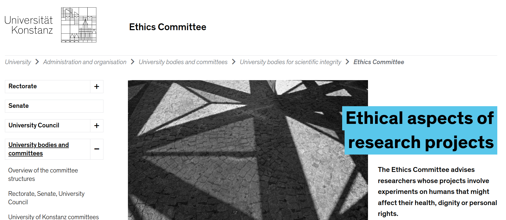
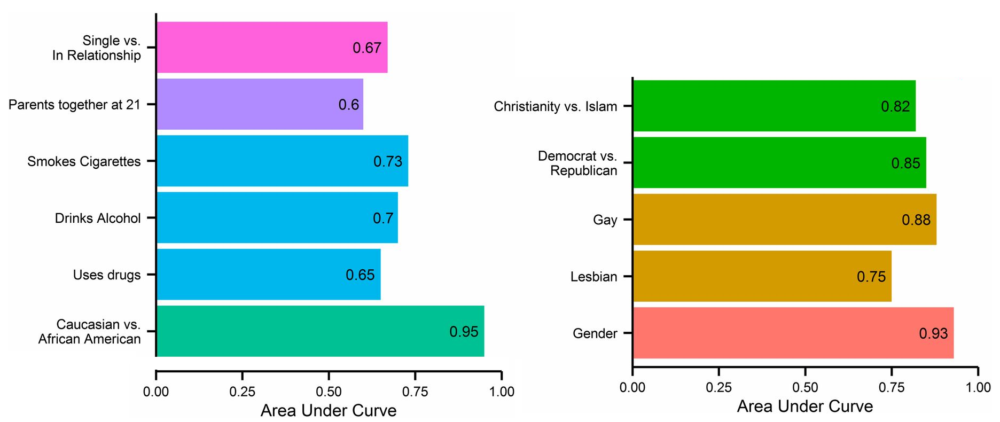

```{r xaringan-themer, include=FALSE, warning=FALSE}
#This block contains the theme configuration for the CSS lab slides style
library(xaringanthemer)
library(showtext)
style_mono_accent(
  base_color = "#5c5c5c",
  text_font_size = "1.5rem",
  header_font_google = google_font("Arial"),
  text_font_google   = google_font("Arial", "300", "300i"),
  code_font_google   = google_font("Fira Mono")
)
```

```{r setup, include=FALSE}
options(htmltools.dir.version = FALSE)
```

layout: true

<div class="my-footer"><span>David Garcia - Social Media Data Analysis</span></div> 

---
# Outline

## 1. Ethics in social media research

## 2. Privacy issues of digital traces

## 3. Discussing a recent case
---

# When social research can do harm

.pull-left[
```{r, echo=FALSE, out.width=550, fig.align='center'}
knitr::include_graphics("figures/Milgram.jpeg")
```

Milgram's authority experiment (1961)
]

.pull-right[
```{r, echo=FALSE, out.width=450, fig.align='center'}
knitr::include_graphics("figures/Zimbardo.jpg")
```

Zimbardo's prison experiment (1971)

]

---

# Research ethics

- **Beneficence and No harm principle:** The purpose of research is to discover new information that would be helpful to society. The purpose of research should never be to hurt anyone or find out information at the expense of other people.

- Researchers often seek to evaluate benefits and harms of their research to indicate that **benefits greatly outweigh potential harms**.

- **Institutional Review Boards (IRB)** for ethics: University processes to safeguard ethical principles in academic research. Scientists submit research designs and the board reviews them and makes a statement about whether the design respects the ethics regulations of the university.


[First do no harm: An exploration of researchers' ethics of conduct in Big Data behavioral studies. Favaretto et al (2020)](https://journals.plos.org/plosone/article?id=10.1371/journal.pone.0241865)

---

## Ethics Committee at the University of Konstanz

.center[]

https://www.uni-konstanz.de/en/university/administration-and-organisation/university-bodies-and-committees/university-bodies-for-scientific-integrity/ethics-committee/
---

## Example reference: the Declaration of Helsinki

.center[]
https://www.wma.net/policies-post/wma-declaration-of-helsinki-ethical-principles-for-medical-research-involving-human-subjects/
---
# Ethics of social media research

Beyond the No harm principle:
 - Respecting privacy expectations of **data subjects**: Data are people
 - Downstream consequences of technological development
 - Right to information in the digital society
 
There is no *magic rule* or *solution* in research ethics: Every research design has to be evaluated in detail and its risks and benefits considered carefully

How to do that is evolving over time, building on examples that expose research ethics issues. Here we are going to see a few that have shaped current research ethics in the analysis of social media data and other digital traces

[Internet Research: Ethical Guidelines 3.0. Association of Internet Researchers (2019)](https://aoir.org/reports/ethics3.pdf)

---

# Preventing harm: Informed consent
.pull-left[

]

.pull-right[

- A way to verify that harm is reduced is to check that research subjects consent to participate in the experiment
- Gathering that consent in an informed way can be challenging
  - Long forms with jargon
  - Unconscious participants
  - Non-invasive or in vivo research

[Users' Views of Ethics in Social Media Research: Informed Consent, Anonymity, and Harm. Williams et al, 2017](emerald.com/insight/content/doi/10.1108/S2398-601820180000002002/full/html)
]
---

## When can you say that consent was informed?

```{r, echo=FALSE, out.width=1200, fig.align='center'}
knitr::include_graphics("figures/Kramer.svg")
```

[Experimental evidence of massive-scale emotional contagion through social networks. Kramer et al, PNAS (2014)](https://www.pnas.org/content/111/24/8788)
---


## When can you say that consent was informed?

```{r, echo=FALSE, out.width=900, fig.align='center'}
knitr::include_graphics("figures/FBconsent.png")
```

- "Blanket consent" without explicit purpose is not considered informed
- The GDPR regulates this and similar clauses are not legal in the EU any more

[Experimental evidence of massive-scale emotional contagion through social networks. Kramer et al, PNAS (2014)](https://www.pnas.org/content/111/24/8788)
---

## Use expectations: when public is not enough

```{r, echo=FALSE, out.width=1300, fig.align='center'}
knitr::include_graphics("figures/Kosinski.png")
```

[Deep Neural Networks Are More Accurate Than Humans at Detecting Sexual Orientation From Facial Images. Kosinski and Wang (2018)](https://www.gsb.stanford.edu/sites/default/files/publication-pdf/wang_kosinski.pdf)

---
## Downstream consequences: coding stereotypes

.center[]

[Do algorithms reveal sexual orientation or just expose our stereotypes? Blaise Aguera y Arcas, Alexander Todorov and Margaret Mitchell (2018)](https://medium.com/@blaisea/do-algorithms-reveal-sexual-orientation-or-just-expose-our-stereotypes-d998fafdf477)

---
## Downstream consequences: coding stereotypes

.center[]

[Do algorithms reveal sexual orientation or just expose our stereotypes? Blaise Aguera y Arcas, Alexander Todorov and Margaret Mitchell (2018)](https://medium.com/@blaisea/do-algorithms-reveal-sexual-orientation-or-just-expose-our-stereotypes-d998fafdf477)

---

# A note on "ethics approval"

.center[]

- IRB only provide statements that a research project design complies with the regulations of the institution regarding human subjects research
- IRB are not "ethics approvals" or "ethics certificates", but they are proof that researchers have followed certain due process to consider ethics issues
- IRB focus on direct harm in experiments (e.g. health adverse effects) and do not consider other downstream social or technical risks

[Authors' note: Deep neural networks are more accurate than humans at detecting sexual orientation from facial images. M. Kosinski & Y. Wang (last update 2022)](https://docs.google.com/document/d/11oGZ1Ke3wK9E3BtOFfGfUQuuaSMR8AO2WfWH3aVke6U)

---

## Downstream consequences: technology misuse
.center[]
[Responses to Critiques on Machine Learning of Criminality Perceptions (Addendum of arXiv:1611.04135), Wu and Zhang (2017)](https://arxiv.org/abs/1611.04135)

---

# Terms of Service vs Right to Information

```{r, echo=FALSE, out.width=1000, fig.align='center'}
knitr::include_graphics("figures/Schwartz.png")
```

[Federal Court Rules 'Big Data' Discrimination Studies Do Not Violate Federal Anti-Hacking Law. Americal Civil Liberties Union (2020)](https://www.aclu.org/press-releases/federal-court-rules-big-data-discrimination-studies-do-not-violate-federal-anti)

---

# Outline

## 1. Ethics in social media research

## *2. Privacy issues of digital traces*

## 3. Discussing a recent case

---

# Personal data and the GDPR
.center[]
- Examples of identifiers: IP addresses, full names, phone numbers, addresses
- Requirement to get data subject consent for processing and for **sharing with other legal entities** (e.g. through an API)
- The GDPR has numerous exceptions that apply to social media data analysis:
  - When data are manifestly made public by the data subject (Art 9.2e)
  - When processing does not require identification (Art 11)
  - For purposes in the public interest, scientific or historical research (Art 5.1b and Art 89)

---

## What is personally identifiable information (PII)? 
.pull-left[

```{r, echo=FALSE, out.width=1200, fig.align='center'}
knitr::include_graphics("figures/AOL.png")
```

[NYT article on AOL data deanonymization](https://www.nytimes.com/2006/08/09/technology/09aol.htmlz)

]

.pull-right[

```{r, echo=FALSE, out.width=1200, fig.align='center'}
knitr::include_graphics("figures/Netflix.png")
```

[Artificial Intelligence magazine on the Netflix challenge deanonymization](https://ai.plainenglish.io/ahh-the-computer-algorithm-still-can-find-you-even-there-is-no-personal-identifiable-information-6e077d17381f)
]
---

## Facebook likes predict private attributes

```{r, echo=FALSE, out.width=900, fig.align='center'}
knitr::include_graphics("figures/F1.large.jpg")
```

Private traits and attributes are predictable from digital records of human behavior [(Kosinski et al, 2013)](https://www.pnas.org/content/110/15/5802)

---


## Facebook likes predict private attributes

```{r, echo=FALSE, out.width=1000, fig.align='center'}

```

Private traits and attributes are predictable from digital records of human behavior [(Kosinski et al, 2013)](https://www.pnas.org/content/110/15/5802)

---
# The Cambridge Analytica Scandal

```{r, echo=FALSE, out.width=750, fig.align='center'}
knitr::include_graphics("figures/CA.jpeg")
```

https://www.ft.com/content/e325e3d0-2c3b-11e8-a34a-7e7563b0b0f4

---

# Privacy Risks in Online Platforms

**Informational self-determination:** The protection of the individual against unlimited collection, storage, use and disclosure of their personal data, the right for the individual to determine the use of their personal data (habeas data).

One approach: Individualized solutions to privacy risks:
> ”Providing users with transparency and control over their information, leading to an individually controlled balance between the promises and perils of the Digital Age.” *(Kosinski et al, 2013)*

<center>
**Can we guarantee individual control over online privacy?**

---
background-size: 20%
background-image: url(figures/puzzle.jpg)
background-position: 98% 70%

## The Problem of Shadow Profiles

**Facebook Shadow Profile:**  
A file that Facebook keeps on you containing data it pulls from looking at the information that your friends voluntarily provide. [*(Digital Trends, 2013)*](https://www.digitaltrends.com/social-media/what-exactly-is-a-facebook-shadow-profile/)

- 2011: Europe-vs-Facebook files complaint on shadow profiles

- 2013: Bug reveals private information of 6 million users

- Some users notice their shadow profiles with mobile numbers

- Apr 2014: 1B users of Facebook for mobile share  contact lists

- Aug 2016: Whatsapp and Facebook share information

Not a problem unique to Facebook: also in Twitter, Google, Amazon...

---

## Auditing Shadow Profiles

**Shadow profile hypothesis:**
The data shared by the users of an online platform predicts of personal information of non-users

```{r, echo=FALSE, out.width=600, fig.align='center'}
knitr::include_graphics("figures/shadowidea.png")
```
**Approach:** historical audit to evaluate how social networking sites could have predicted information of individuals who were not users yet 
<div style="font-size:15pt"> 
[One Plus One Makes Three (for Social Networks). Emöke-Ágnes Horvát, Michael Hanselmann, Fred Hamprecht, Katharina Zweig. Plos ONE (2012)](https://journals.plos.org/plosone/article?id=10.1371/journal.pone.0034740)

---

## Shadow profiles case: Location in Twitter

.pull-left[
```{r, echo=FALSE, out.width=1100, fig.align='center'}
knitr::include_graphics("figures/TwitterLocation.png")
```
]
.pull-right[
- Random sample of 1,017 users
  - excl. bots, mass media
- Ego network of reply links
  - 68,447 alters
- Timelines: 157M tweets
- Location from profile text + Google Maps API
- Tweet metadata to identify users sharing contact lists
]

---

## Twitter shadow profile test

```{r, echo=FALSE, out.width=1100, fig.align='center'}
knitr::include_graphics("figures/TwitterProblem.png")
```

- Data represents a bidirectional social network
- Joined date of users shows network growth
- Tweet metadata contains posting app: disclosing users are only those who post at least once from Twitter mobile apps (shared contact lists)
- Predicting location of users who didn't join yet based on disclosing friends already on Twitter
---

## Location prediction and heterogeneity

```{r, echo=FALSE, out.width=1000, fig.align='center'}
knitr::include_graphics("figures/alters.png")
```

- Location prediction of non-users greatly outperforms null model
- Individuals with more alters sharing contact lists in Twitter have lower error

---

## Shadow profiles after leaving a social network

```{r, echo=FALSE, out.width=800, fig.align='center'}
knitr::include_graphics("figures/Shadow2.png")
```
<div style="font-size:15pt"> 
[**Privacy beyond the individual.** David Garcia. Nature Human Behavior (2019)](https://www.nature.com/articles/s41562-018-0513-2)

[**Information flow reveals prediction limits in online social activity.** James Bagrow, Xipei Liu & Lewis Mitchell. Nature Human Behavior (2019)](https://doi.org/10.1038/s41562-018-0510-5)

---

### Complex privacy: Online privacy as a collective phenomenon

.pull-left[
- The decision of individuals to share data is mediated by the decisions of others
- Privacy externalities of the contract between a user and a platform
- Complex problems, collective solutions: International data cooperatives
]
.pull-right[
```{r, echo=FALSE, out.width=500, fig.align='center'}
knitr::include_graphics("figures/wired.png")
```
]
<div style="font-size:16pt"> 
[**Online privacy as a collective phenomenon.** E. Sarigol, D. Garcia, F. Schweitzer. Second ACM Conference on Online Social Networks (COSN) (2014)](https://dl.acm.org/doi/10.1145/2660460.2660470)  
[**Leaking privacy and shadow profiles in online social networks.** D. Garcia, Science Advances, 3 (8) e1701172 (2017)](https://advances.sciencemag.org/content/3/8/e1701172.full)  
[**Collective Aspects of Privacy in the Twitter Social Network.** D. Garcia, M. Goel, A. Agrawal, P. Kumaraguru, EPJ Data Science, 7(3) (2018)](https://epjdatascience.springeropen.com/articles/10.1140/epjds/s13688-018-0130-3)  
[**Privacy beyond the individual.** D. Garcia. Nature Human Behavior (2019)](https://www.nature.com/articles/s41562-018-0513-2)

---

## Summary: Ethics and privacy in SMDA

- Weigh benefit and risk before deciding to start research

- Public data is not automatically fair game: data are people

- Privacy is not binary: Is my research in the interest of the data subjects?

- Ethical data sharing: do share research data, but carefully

- Informed consent is not ticking a box. Do debriefing

- Consider downstream consequences: how can my science be misused?

- Society has a right to information: critically consider Terms of Service


[Ten simple rules for responsible big data research. Zook et al. (2017)](https://journals.plos.org/ploscompbiol/article?id=10.1371/journal.pcbi.1005399)

---

# Outline

## 1. Ethics in social media research

## 2. Privacy issues of digital traces

## *3. Discussing a recent case*


---
# A recent case: Koko and GPT-3

.center[]
---

# A recent case: Koko and GPT-3

.center[]
---

# A recent case: Koko and GPT-3
.center[]
---

# Summary

- **Ethics in social media data analysis**
  - No harm principle
  - Cases of previous ethical issues in digital trace data research
  - Recommendations for Big Data research


- **Privacy in the digital society**
  - Digital traces predict private attributes
  - Informational self-determination
  - Online privacy is complex: the shadow profiles problem
  
  
- **A recent case**
  - Reasons to do it? benefit for participants and society?
  - Risks to participants? Harm or also privacy?
  - Other downstream risks/benefits

