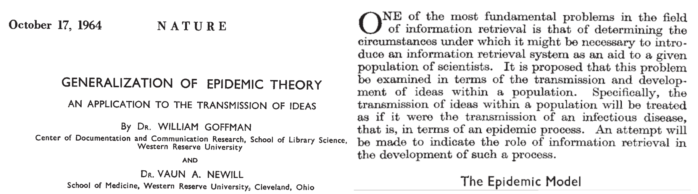
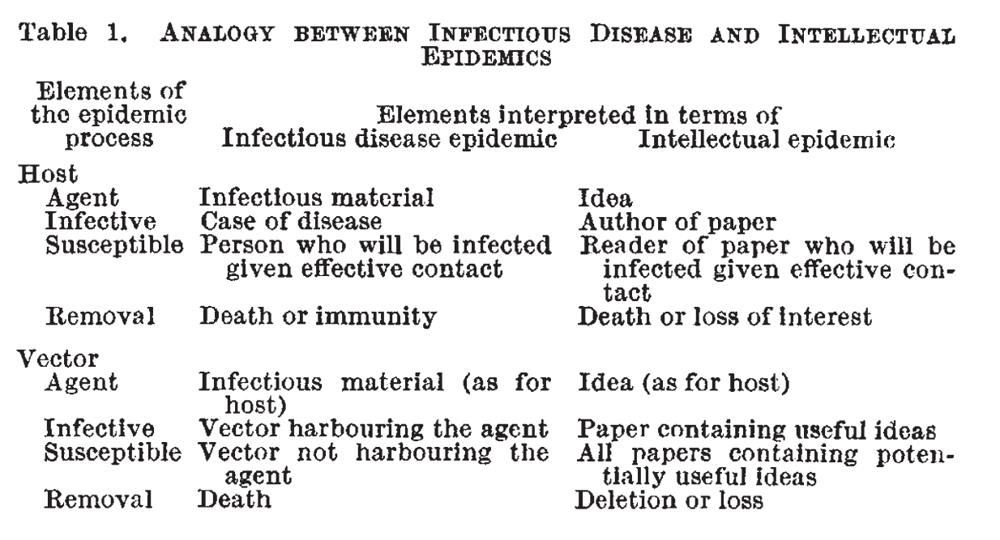
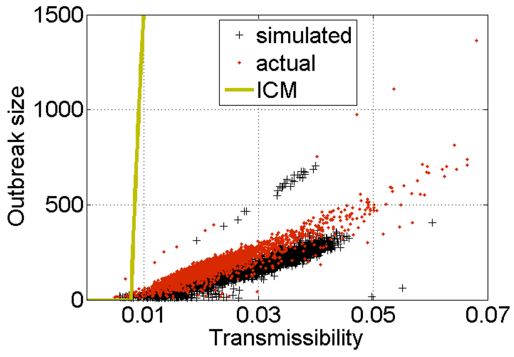

```{r xaringan-themer, include=FALSE, warning=FALSE}
#This block contains the theme configuration for the CSS lab slides style
library(xaringanthemer)
library(showtext)
style_mono_accent(
  base_color = "#5c5c5c",
  text_font_size = "1.5rem",
  header_font_google = google_font("Arial"),
  text_font_google   = google_font("Arial", "300", "300i"),
  code_font_google   = google_font("Fira Mono")
)
```

```{r setup, include=FALSE}
options(htmltools.dir.version = FALSE)
```

layout: true

<div class="my-footer"><span>David Garcia - Social Media Data Analysis</span></div> 

---

# Outline

## 1. Social Impact Theory

## 2. Social Influence in Online Media

## 3. Linear Regression in SMDA

---


# What is Social Impact?

<div style="float:right">
  
</div>

> **Social Impact:** Changes in behavior that occur in an individual as a result of presence or actions of other individuals

Examples of behavior: subjective feelings, motives, emotions, thoughts, customs, decisions...  

The presence or actions of others can be:  

- *real:* the physical presence of others  
- *implied:* expected or manipulated presence, e.g. a cardboard policeman  
- *imagined:* mental representation of others, e.g. supporters of your team when watching TV sports

---

# Asch's conformity experiments


Elevator experiment in Candid Camera (1962)

---

# Social Impact Theory (Bibb Latané)
<center>

</center>

---

# Social forces in SIT

In [Social Impact Theory](http://psycnet.apa.org/psycinfo/1982-01296-001), social impact is driven by three forces in the following equation:
$$I = f (S × i × N)$$

- $I$ is the magnitude of social impact

- $f()$ is a multiplicative function of three conditions of the impacting situation:

  1. **Strength** $S$ or power of the source(s)  

  2. **Immediacy** $i$ or proximity of the source(s)

  3. **Number of sources** $N$ or number of people

---

# Multiplicative effects

.center[]

$I = f (S × i × N)$  resembles the effect in brightness of a surface illuminated by a number of light sources, their typical strength, and their proximity to the surface

---

# N: Number of sources

<div style="float:right">
  </div>
</br>
</br>
SIT predicts that impact should grow with N. Asch's conformity experiments test this hypothesis, where:

- $I$: increase in percentage of wrong answers given by students that were experiment subjects

- $N$: controlled number of confederates

The result: the percentage of wrong answers grows with the amount of sources.

---

# The Psychosocial Law

<div style="float:right">
  </div>

> **The Psychosocial Law:** The extent of social impact grows sublinearly with the number of sources  

This can be translated to the equation:
$$I \propto N^t, t < 1$$

This means that the hundredth source has less additional effect than the first (*diminishing returns*).

The equation is what is called a power-law with exponent $t$. In the case of conformity among high school students, $t$ was estimated to be 0.48.

---

<div style="float:right">
  
</div>

# S: Strength of sources

The strength in SIT is the perceived social status, power, wealth, importance, or intensity of the sources. Poem experiment example:

- $I$: anxiety of the students recorded with a dial they use to measure their own anxiety

- $N$: number of people in the audience

- $S$: audience is middle-aged (strong) or teenagers (weak)

**Multiplicative effect:** The impact of the number of sources grows faster when they are strong than when they are weak

---

# i: Immediacy of sources

<div style="float:right">
  
</div>

Immediacy is defined as the proximity between the sources and the target of social impact. Immediacy can be spatial, temporal, or social.
The effect of immediacy in media bias experiments: 
- $I$: number of lines used to report the news by the students
- $N$: number of people reported dead in the accident
- $i$: is the distance to the place of the accident (close vs far conditions)

Results: The growth of impact with N was steeper for the close condition

---

# Division of impact
<center>

</center>
---

# Division of impact

Social Impact Theory also covers situations with one source but when when targets are not alone. It formulates the impact $I$ on **each** target as:  
$$I = f\left(\frac{1}{S × i × N}\right)$$ Where the terms are:  
- $S$ strength of the targets: the stronger the targets, the harder to impact each one.  
- $i$ immediacy between the targets: the closer or more connected the targets, the harder to impact each one.  
- $N$ the more the targets in the group, the harder to impact each one.
- $f()$ is a multiplicative function with negative exponents for the terms.

---
<div style="float:right">
  
</div>
# Division of impact

The most widely studied divisor of impact is group size (N). An observational study finds the effect for the case of restaurant tips:

- $I$: Percentage of tip (assumed evenly shared among customers)
- $N$: number of customers at the table

Result: $I$ decreases as $N$ increases. The more people sitting at the same table, the less obliged each one feels to leave a tip. The resulting shape of I as a function of N is well fitted by a negative power of N. 

---

# Outline

## 1. Social Impact Theory

## *2. Social Influence in Online Media*

## 3. Linear Regression in SMDA

---

# An example of online social influence

.center[  ]

---

## The viral analogy of online social sharing
.center[
  
]

- Humans both transmit diseases and behavior to each other
- The viral analogy illustrates copied behavior and a virus: when some conditions are met, it can reach the whole population
- This analogy is the basis of viral marketing: what makes content spread?

---
# The origin of the viral analogy
.center[]

[Generalization of Epidemic Theory: An Application to the Transmission of Ideas. Goffman & Newill, Nature (1964)](https://www.nature.com/articles/204225a0)
---

# Formalizing the analogy

.center[]

---

# Formalizing the analogy

| Element      | Infectious disease epidemic | Intellectual epidemic | Online epidemic |
| :----: | :----: | :----: | :----: |
| Agent   | Infectious material   | Idea in paper | Online post        |
| Infective   |   Case of disease      |   Author of paper  | User posting social media content     |
| Susceptible   |   Person infected in face to face contact      |  Reader influenced by paper | User liking or resharing content        |
| Removal   |   Death or immunity      |  Death or loss of interest | User forgetting or changing attention      |


---

# Simple versus complex contagion

The spreading analogy implies **simple contagion**: each exposure has a probability of behavior adoption independent of anything else

**Complex contagion:** multiple exposures might be necessary to enable any contagion, especially for risky behavior

Social Impact Theory predicts that:
- the number of sources will matter in a sublinear way
- immediacy will have a positive effect in influence
- not all sources are equal in strength when influencing others

[Complex Contagions and the Weakness of Long Ties. Centola & Michael Macy. American Journal of Sociology (2007)](https://www.journals.uchicago.edu/doi/10.1086/521848)

---

## Revising the viral analogy in social media

.pull-left[.center[]]

.pull-right[.center[]
]

- Social impact on Twitter: [Differences in the mechanics of information diffusion across topics: idioms, political hashtags, and complex contagion on twitter. Romero, Meeder & Kleinberg, WWW conference (2011)](https://dl.acm.org/doi/abs/10.1145/1963405.1963503).
- Review including Digg data analysis: [Information Is Not a Virus, and Other Consequences of Human Cognitive Limits, Kristina Lerman, Future Internet (2016)](http://www.mdpi.com/1999-5903/8/2/21).

---

# Effect of immediacy
.center[  ]

- Probability to adopt behavior is not constant over time: temporal immediacy
- Probability to adopt behavior decreases very fast with time since exposure

---

# Limits to the psychosocial law online
.center[  ]

- Probability of adoption versus number of sources
- Growth in impact saturates: not a case of simple contagion
- Growth in impact stops at some point or even reverses. Effect of information overload not hypothesized by Social Impact Theory.

---

# When spreading is not so viral

.pull-left[
Independent Cascade Model (ICM)
- Simulation on social network without considering number of exposures and immediacy
- Comparison versus empirical size of cascades (digg number) and simulations including SIT
- ICM wildly overestimates cascades sizes: things are not "so viral"

]

.pull-right[
]


[Information Is Not a Virus, and Other Consequences of Human Cognitive Limits, Kristina Lerman, Future Internet (2016)](http://www.mdpi.com/1999-5903/8/2/21)

---

# Division of Impact in Social Media

.pull-left[.center[]]

.pull-right[.center[]
]

In exercise 2, you will test the division of impact hypothesis:
- On a Twitter US politicians dataset
  - Aggregating the average number of retweets versus number of followers
- On your own sample of YouTube channels through the API
  - Measuring mean number of views versus number of subscribers
- Fitting a model to test if impact is sublinear with audience size

---

# Outline

## 1. Social Impact Theory

## 2. Social Influence in Online Media

## *3. Linear Regression in SMDA*

---

# Linear Regression

Regression models formalize an equation in which one numeric variable $Y$ is formulated as a linear function of other variables $X_1$, $X_2$, $X_3$, etc: <center>
$Y = a + b_1 X_1 + b_2 X_2 + b_3 X_3 ... + \epsilon$
</center>
- $Y$ is called the dependent variable

- $X_1$, $X_2$, $X_3$, etc are called independent variables

- $a$ is the intercept, which measures the expected value of $Y$ that does not depend on the dependent variables

- $b_1$, $b_2$, $b_3$, etc are called the slopes or the coefficients

- $\epsilon$ are the residuals, the errors of the equation in the data

---


---
# Example: FOI vs GDP

```{r echo=F, message=F, results='hide', fig.width=9, fig.align='center'}
library(dplyr)
df <- read.csv("FOI.csv")
df$GDP <- df$NY.GDP.PCAP.PP.KD
df %>% filter(SP.POP.TOTL*IT.NET.USER.ZS/100 > 5000000) -> df
model <- lm(GDP~FOI, df)
par(mar=c(4,5,0,0))
plot(df$FOI, df$GDP, xlab="FOI", ylab="GDP per capita", cex.axis=2, cex.lab=2)
abline(model$coefficients[1], model$coefficients[2], col="red")
```

---

# Regression residuals

Residuals ( $\epsilon$ ) are the differences in between the empirical values $Y_i$ and their fitted values $\hat Y_i$.
```{r echo=F, message=F, results='hide', fig.width=10, fig.height=6, fig.align='center'}
library(dplyr)
par(mar=c(4,5,0,0))
plot(df$FOI, df$GDP, xlab="FOI", ylab="GDP per capita", cex.axis=2, cex.lab=2)
abline(model$coefficients[1], model$coefficients[2], col="red")
segments(df$FOI,model$fitted.values, df$FOI,df$GDP, col="darkgreen")
```

---

# Ordinary Least Squares (OLS)

**Fitting** a regression model is the task of finding the values of the coefficients ( $a$, $b_1$, $b_2$, etc ) in a way that reduce a way to aggregate the residuals of the model. One approach is called Residual Sum of Squares (RSS), which aggregates residuals as:

<center>
$RSS = \sum_i (\hat Y_i - Y_i)^2$
</center>  
The Ordinary Least Squares method (OLS) looks for the values of coefficients that minimize the RSS. This way, you can think about the OLS result as the line that minimizes the sum of squared lengths of the vertical lines in the figure above.


---

# Goodness of fit

A way to measure the quality of a model fit this is to calculate the proportion of variance of the dependent variable ( $V[Y]$ ) that is explained by the model. We can do this by comparing the variance of residuals ( $V[\epsilon]$ ) to the variance of $Y$. 

This is captured by the coefficient of determination, also known as $R^2$:
<center>
$R^2 = 1 − \frac{V[\epsilon]}{V[Y]}$
</center>  
For our model example, the $R^2$ is `r 1-var(residuals(model))/var(df$GDP)`

---

# Model likelihood

- Likelihood $\hat L$, probability of the observed data ( $y$ ) given the model ($M$) and our estimation of its parameters $\hat \Theta$: 
$$\hat L = p(y | \hat \Theta, M)$$
- It is calculated as the product of the likehood of each observation
$$\hat L = p(y_1| \hat \Theta, M) * p(y_2| \hat \Theta, M) ... p(y_N| \hat \Theta, M) =  p(y | \hat \Theta, M)$$

---

# The case of linear regression

Our formulation of the regression model:

$$Y = a + b_1 X_1 + b_2 X_2 + b_3 X_3 ... + \epsilon$$

With the assumption that residuals are unbiased, independent, and normal:
$$\epsilon \sim N(0,\sigma^2)$$
Can be reformulated as:
$$Y \sim N(a + b_1 X_1 + b_2 X_2 + b_3 X_3..., \sigma^2)$$ 
Where our parameter vector is: $\Theta =  [a, b_1, b_2, b_3 ...]$
---

# The case of linear regression

We can write it as a conditional probability using the Gaussian probability density function:

$$f(Y|X; \Theta, \sigma^2) = \frac{1}{\sqrt{2 \pi \sigma^2}} exp (\frac{-(Y-(a + b_1 X_1 + b_2 X_2 + b_3 X_3...))^2}{2\sigma^2}) $$
And this way calculate the likelihood function:

$$L(\Theta, \sigma^2) = \frac{1}{\sqrt{2 \pi \sigma^2}} \prod_{(y, x_1, x_2, x_3 ...)} exp (\frac{-(y-(a + b_1 x_1 + b_2 x_2 + b_3 x_3...))^2}{2\sigma^2}) $$
Maximizing the likelihood for a given data is a way of fitting model parameters and comparing models

---

# Bayesian and Akaike Information Criteria

- Likelihood functions do not consider the number of parameters of a model
  - Risk of overfitting: it is easier to get a higher likelihood $L$ with more parameters
- Information criteria correct for the number of parameters $k$ and sample size $N$ so we can compare models with different numbers of parameters:
  - Bayesian Information Criterion: 
  $$BIC = k * ln(N) - 2 * ln(L)$$ 
  - Akaike Information Criterion:
   $$AIC = 2 * k - 2 * ln(L)$$ 
- The BIC penalizes more the number of parameters than the AIC
---

<center>

</center>

---

# Summary

- Social Impact Theory
  - How a social situation determines the extent of behavior change
  - Hypothesizes a multiplicative effect of the number of sources, their strength, and their immediacy
  - Extends to one source and an audience with division of impact


- Social Influence in Online Media
  - The origin of the viral analogy and its limitations
  - Examples of Digg and Reddit and where SIT starts to fail


- Linear Regression in SMDA
  - How to estimate a quantity as a linear combination of others
  - Goodness of fit: R squared and likelihood-based metrics

---