```{r xaringan-themer, include=FALSE, warning=FALSE, cache=T}
#This block contains the theme configuration for the CSS lab slides style
library(xaringanthemer)
library(showtext)
style_mono_accent(
  base_color = "#5c5c5c",
  text_font_size = "1.5rem",
  header_font_google = google_font("Arial"),
  text_font_google   = google_font("Arial", "300", "300i"),
  code_font_google   = google_font("Fira Mono")
)
```

```{r setup, include=FALSE, cache=T}
options(htmltools.dir.version = FALSE)
```

layout: true
<div class="my-footer"><span>David Garcia - Social Media Data Analysis</span></div> 

---

# Outline

## 1. The Simmel effect

## 2. Baby names: Big old trend data

## 3. Online trend dynamics

## 4. Bootstrapping

---

# Trends and social impact

**The question of trends: How does social impact aggregate in a society?**

.center[]

---

# Hipsters and fashion
.center[]

> Oblivious to the paradox of their uniform individuality” (Dan Ashcroft, Nathan Barley)

---

# Georg Simmel

.center[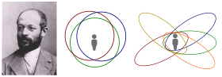]
- One of the fathers of Sociology
- Studied how social structures vary across societies
- Formulated theories on how premodern and modern societies differ
---

# Theory of fashion: the Simmel Effect

Georg Simmel defined fashion as the *non-cumulative change in cultural features*, where cultural features are displayed as *status symbols*. Status symbols are externally displayed traits associated with high social class, e.g. surnames, clothing, sport, food, etc.

> **The Simmel effect:** The persistence of social differences under the instability of status symbols

Simmel noticed that fashions come and go, but fashion is always present. When something becomes popular, it is bound to lose its popularity. Simmel introduced this theory in his 1904 article ["Fashion"](https://www.jstor.org/stable/2773129?seq=1), describing observations that are still relevant, such as how going against fashion is a way to acknowledge its relevance (the hipster paradox).

---

## The mechanisms of Simmel's theory: </br> Imitation

.center[]

---

## The mechanisms of Simmel's theory: Differentiation

.center[]
---
.center[]
---

# The case of baby names
.center[]
First names can be status symbols and carry subjective and social values. Copying the name of your baby from someone else is an example of imitation.

---

#  Baby names: Big old trend data

## 1. The Simmel effect

## *2. Baby names: Big old trend data*

## 3. Online trend dynamics

## 4. Bootstrapping

---
# US SSA baby name data
```{r, message=F, results='hide', fig.width=14, fig.height=6.5, echo=F, cache=T, fig.align='center'}
# You can read the data without decompressing it using the gzfile function. 
library(dplyr)
df <- read.csv(gzfile("BabyData2019.csv.gz"))
df %>% group_by(year) %>% summarize(nbabies=sum(count)) -> total
par(mar=c(4.5,4.5,0,0))
plot(total, ylab="babies", type="l", lwd=2, cex.lab=2, cex.axis=2)
```
---

# Baby name trend examples

```{r, message=F, results='hide', fig.width=14, fig.height=6.5, echo=F, cache=T, fig.align='center'}
name1 <- "Angelina"
name2 <- "Leonardo"
df %>% filter(name==name1 & year>=1940) %>% group_by(year) %>% summarize(nbabies=sum(count)) -> total
par(mar=c(4.5,4.5,0,0))
plot(total, ylab="babies", type="l", lwd=2, cex.lab=2, cex.axis=2)
df %>% filter(name==name2 & year>=1940) %>% group_by(year) %>% summarize(nbabies=sum(count)) -> total
lines(total, lwd=2, col="red")
legend("topleft",legend=c(name1, name2), col=c("black","red"), lwd=2, cex=3)
```


---

# The QWERTY effect in baby names

The QWERTY effect is a hypothesis in Psychology that postulates that words that are written with more right-hand letters of the keyboard are, on average, more positive than words that are written with more left-hand letters of the keyboard. The fraction of right-hand letters in US baby names has been increasing:
```{r, message=F, results='hide', fig.width=14, fig.height=5, echo=F, cache=T, fig.align='center'}
library(stringr)
df %>% group_by(name,year) %>% summarize(count=sum(count)) %>% filter(year>1960)-> ngdf

df$R <- str_count(pattern='[yuiophjklnm]',tolower(df$name))
df$L <- str_count(pattern='[qwertasdfgzxcvb]',tolower(df$name))

df %>% group_by(year) %>% summarize(RSA = sum(count *(R-L)), n=sum(count)) %>% filter(year>=1960)-> RSAdf
par(mar=c(4.5,4.5,1.5,0))
plot(RSAdf$year, RSAdf$RSA/RSAdf$n, type="l", lwd=2, xlab="year", ylab="mean RSA", cex.lab=2, cex.axis=2)
```
---

# Wacky baby name research

```{r, message=F, results='hide', fig.width=14, fig.height=5.5, echo=F, cache=T, fig.align='center'}
tempdf <- read.csv("https://www.epa.gov/sites/production/files/2016-08/temperature_fig-1.csv", skip=6)

df %>% filter(year>=1937) %>% group_by(year,gender) %>% summarize (nnames=n()) -> udf
sdf <- inner_join(udf, tempdf, by=c("year"="Year"))
par(mar=c(4.5,4.5,1.5,0))

plot(sdf$Earth.s.surface[sdf$gender=="M"], sdf$nnames[sdf$gender=="M"], col="lightblue", pch=19, xlim=range(sdf$Earth.s.surface), ylim=range(sdf$nnames), ylab="Number of Unique Names", xlab="US temperature anomaly (Fahrenheit)", cex.lab=2, cex.axis=2)
model <- lm(nnames~Earth.s.surface, data=sdf, subset=gender=="M")
abline(model$coefficients[1], model$coefficients[2], col="lightblue")
points(sdf$Earth.s.surface[sdf$gender=="F"], sdf$nnames[sdf$gender=="F"], col="pink", pch=19)
model <- lm(nnames~Earth.s.surface, data=sdf, subset=gender=="F")
abline(model$coefficients[1], model$coefficients[2], col="pink")
```
A parody paper titled ["We are entering an unprecedented age in baby name flux"](https://instsci.org/h7.html) reported; "baby name diversity also seems to have risen with the increasing annual temperature of the US (i.e., climate change)". 
---

# The limits of baby name predictability

Baby names are a popular example to illustrate scientific topics. The book [Freakonomics](https://freakonomics.com/books/) explains the imitation part of the Simmel effect and explains how people imitate their richer neighbors when naming their babies. The book goes as far as making a prediction of what will be the top US baby names in 2015, based on a data analysis exercise that is never explained in detail in the article. Here is the prediction:


---

### Top 10 names in 2015 and 2004
```{r, fig.width=7, fig.height=6, echo=F, message=F, results="asis", cache=T}
library(knitr)

df %>% filter(year==2015 & gender=="F") %>% arrange(desc(count)) -> Fdf
head(Fdf, 10) %>% arrange(name) %>% select(name) -> Fdf
df %>% filter(year==2004 & gender=="F") %>% arrange(desc(count)) -> Fdf4
head(Fdf4, 10) %>% arrange(name) %>% select(name) -> Fdf4

df %>% filter(year==2015 & gender=="M") %>% arrange(desc(count)) -> Mdf
head(Mdf, 10) %>% arrange(name) %>% select(name) -> Mdf
df %>% filter(year==2004 & gender=="M") %>% arrange(desc(count)) -> Mdf4
head(Mdf4, 10) %>% arrange(name) %>% select(name) -> Mdf4

kable(data.frame(topFemale2015=Fdf$name, topFemale2004=Fdf4$name, topMale2015=Mdf$name, topMale2004=Mdf4$name))
```

---
## Predicting is hard
There is not much overlap between the prediction and the results for 2015. Just using the 2004 list, you would have made a better prediction.

What you see is that predicting which names in particular will be the most popular is a very difficult task. The Simmel effect describes forces that create observable patterns, but that does not mean that the model is predictive to tell us which of all names will become popular ten years from now, even if we had data of the social status of parents. 

This is the difference between explanatory and predictive power of a model. A model can explain phenomena without being useful to make predictions, as in this case, but can also be predictive without giving explanations, like in the case of deep learning or other black-box approaches.

> **Take home message:** understanding does not imply predictive power


---


# Online trend dynamics

## 1. The Simmel effect

## 2. Baby names: Big old trend data

## *3. Online trend dynamics*

## 4. Bootstrapping

---

# Social stage model of collective coping

.pull-left[
- People react to an external event (e.g emergencies)
- Trend of talking and thinking about the event
- **Emergency phase:** High levels of thinking and talking
- **Inhibition/satiation phase:** Fast decrease in talking, slower in thinking
- **Adaptation phase:** Both talking and thinking go back to baseline
]
.pull-right[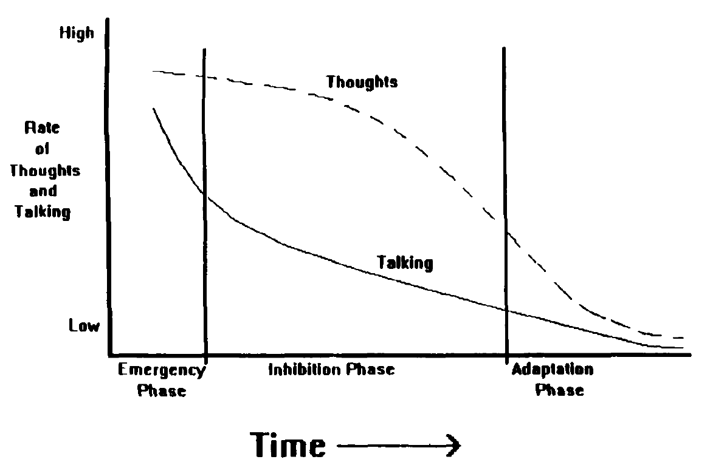]


[A Social Stage Model of Collective Coping: The Loma Prieta Earthquake and The Persian Gulf War.
J. Pennebaker and K. Harber. Journal of Social Issues (1993)](http://onlinelibrary.wiley.com/doi/10.1111/j.1540-4560.1993.tb01184.x/pdf)


---

# Social trends in online platforms

Google search trends can capture data about these large-scale social trends:

.center[]

Exogenously triggered search volume after a tsunami (left) and endogenously driven search for the Harry Potter movie (right).

---

# Exogenous versus endogenous bursts

.center[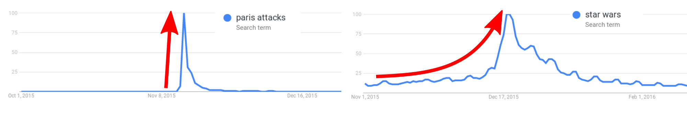]

- **Exogenous burst:** Spike created by an **external event**  
  - Unexpected terrorist attack creates a very fast increase, the event is *external to the community*
- **Endogenous burst:** Peak driven by **social influence in the community**
  - Anticipation for a movie and word of mouth \emph{within a community} creates a slower increase
- Exogenously triggered search volume after a terrorist attach (left) and endogenously driven search for the a Star Wars movie (right).

---


# Subcritical and critical dynamics

.center[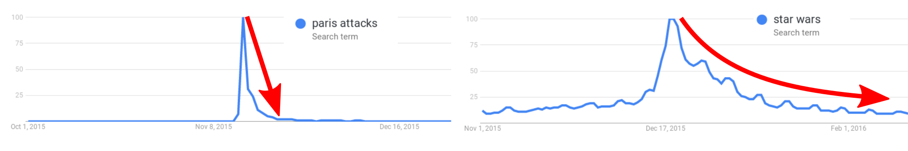]

- Types of social trends after the peak of a collective aggregate of a community
- Examples with Google trends volume
- **Subcritical dynamics:** Fast relaxation due to **social influence weaker than novelty decay**
  - Interest in the US about the attacks was limited, the peak relaxed fast
- **Critical dynamics:** Slow relaxation due to **social influence stronger than novelty decay**
  - Hype about Star Wars movie kept people talking and searching about it


---

# The endo-exo model

<div style="float:right">

</div>

[The endo-exo model of Riley Crane and Didier Sornette](http://www.pnas.org/content/105/41/15649.abstract) captures these types of dynamics. In this model, a trend can have two properties:  

- It can have an **exogenous trigger** when a central event influences lots of people at the same time, as in the tsunami example.
- It can be **critical** when the social interaction between individuals leads to further responses and it is stronger than the rate of losing interest.

---

# Endogenous subcritical

.pull-left[
- **Endogenous:** absence of strong spike
- **Subcritical:** social influence absent or weaker than novelty decay
- **Trend:** noisy signal of incoherent activity
  - No identifiable peak
  - Example: most of content in social media
  
]

.pull-right[.center[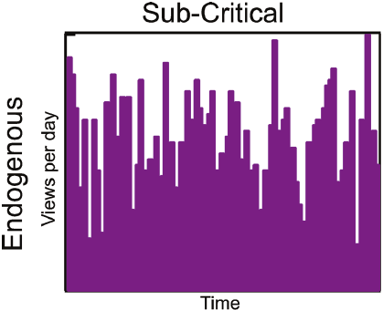]
  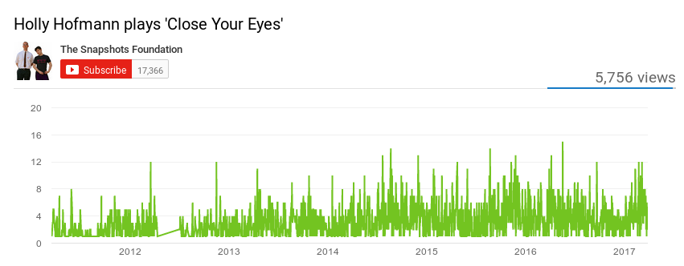
]

---

# Endogenous critical

.pull-left[
- **Endogenous:** peak present without spikes
- **Critical:** social influence stronger than novelty decay
- **Trend:** large wave with slow increase and decrease
  - Less than $20\%$ total volume at the peak
  - Example: content that becomes popular in social media
]

.pull-right[.center[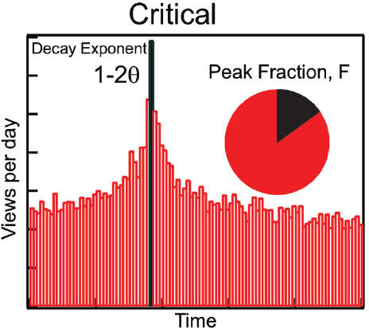]
  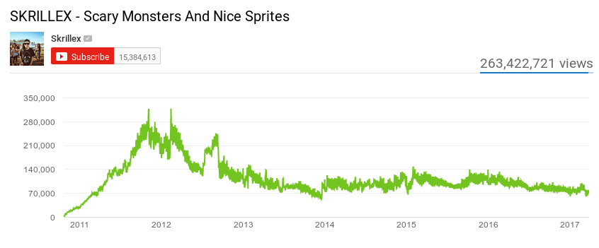
]

---

# Exogenous subcritical

.pull-left[
- **Exogenous:** peak as spike produced by an external event
- **Subcritical:**  Social influence weaker than novelty decay
- **Trend:** sudden growth and decrease
  - More than $80\%$ total volume at the peak
  - Example: junk content featured in mass media
]

.pull-right[.center[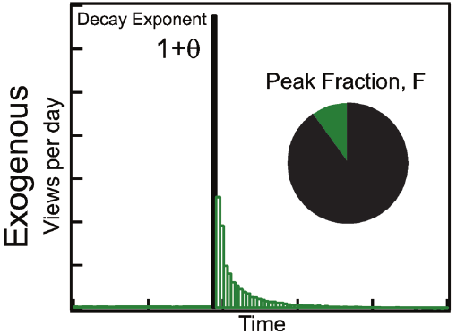]
  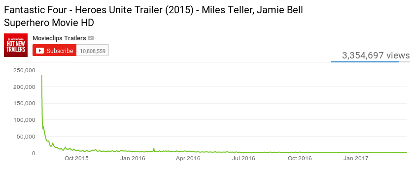]
  
---


# Exogenous critical

.pull-left[
- **Exogenous:** Spike generated by external factor
- **Critical:** Social influence stronger than novelty decay
- **Trend:** Spike growth with slow decay
  - Between $20\%$ and $80\%$ total volume at the peak
  - Example: Central channels creating successful popular content
]

.pull-right[.center[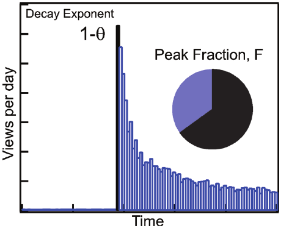]
  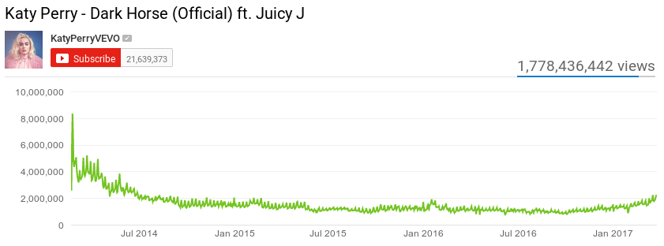]
  
---

# Peaks in the endo-exo model: summary

<div style="float:right">

</div>

These two properties are not exclusive, leading to four types of responses:  

1. **Endogenous sub-critical**: no clear peak, absence of trend.
2. **Endogenous critical**: "viral" peak driven by word of mouth.
3. **Exogenous sub-critical**: sharp peak but fast decay due to lack of strong social interaction.
4. **Exogenous critical**: sharp peak but slow decay due to strong interaction after shock.

---

# Trends on Twitter

This model has been applied to classify Twitter hashtag trends by [Lehmann et al](http://dl.acm.org/citation.cfm?id=2187871). The figure shows activity volumes related to three of the classes in the model. 


Gathering this kind of volume data is best done by using the Twitter API. You will learn how to do this from Python in the course exercises.

---

# Bootstrapping

## 1. The Simmel effect

## 2. Baby names: Big old trend data

## 3. Online trend dynamics

## *4. Bootstrapping*


---

# Assessing uncertainty via bootstrapping

.center[  ]

Bootstrap simulates the sampling of our original data.  
To bootstrap, we resample from our sample by generating new samples of the same size as our original sample  **with replacement**
---

# Example: the mean of a variable

First, we load the data and measure the mean over our sample. We will use the height Data from National Health Interview Survey (NHIS) 2007. The first few heights in the dataset look like this (inches):

```{r echo=F, results='asis', cache=T}
DataFrame <- read.csv("NHIS2007.csv")
ObservedHeights <- DataFrame$height
cat(head(ObservedHeights))
BootSample <- sample(ObservedHeights, replace = T)
```

With the mean height over the sample being `r mean(ObservedHeights)` inches.

To generate a boostrap sample we should resample once with replacement and compute the mean over the resulting sample. An example of bootstrap mean is `r mean(BootSample)` inches.


---

# Running the resampling 

You will see that this mean value is slightly different as the first one. We have simulated what would be another sample from the total population, assuming that the first sample was representative of the total population.

Now we can repeat the bootstrap sample and measurement a lot of times, here we do it 10000 with a loop, saving the results in a vector. The vector will look like this:


```{r echo=F, results='asis', cache=T}
# obtaining M bootstrap samples and calculate mean value of each bootstrap sample
M <- 10000
r.mean <- numeric(M)
for(i in 1:M)
{
  BootSample <- sample(ObservedHeights, replace = T)
  r.mean[i] <- mean(BootSample)
}
cat(head(r.mean))
```

Over the results we can now see the median, which is the point that separates 50% of the results on one side and 50% on the other. In this case the median is `r median(r.mean)` inches.
---

# Uncertainty in the measure

```{r echo=F, fig.height=5.2, fig.align='center', cache=T}
hist(r.mean, main="", xlab="mean of bootstrap sample") # plot histogram of the measured means over the boostrap samples
```

- Histogram of means measured over each bootstrap sample
- 95% of the examples fell between ```r quantile(r.mean, 0.025)``` and ```r quantile(r.mean, 0.975)```, this is called the 95% confidence interval.

---

# Summary

- The Simmel effect
  - Studying fashions as changes in status symbols
  - Model explains them as generated by imitation and differentiation


- Baby names statistics
  - An example of trend analysis of status symbols
  - Old registry data can also be big data


- Online trend dynamics and the endo-exo model
  - Trend patterns as a combination of exogenous shocks and word of mouth dynamics


- Bootstrapping
  - Assessing uncertainty in the measurement of a statistic
  - Idea: resampling with replacement many times

