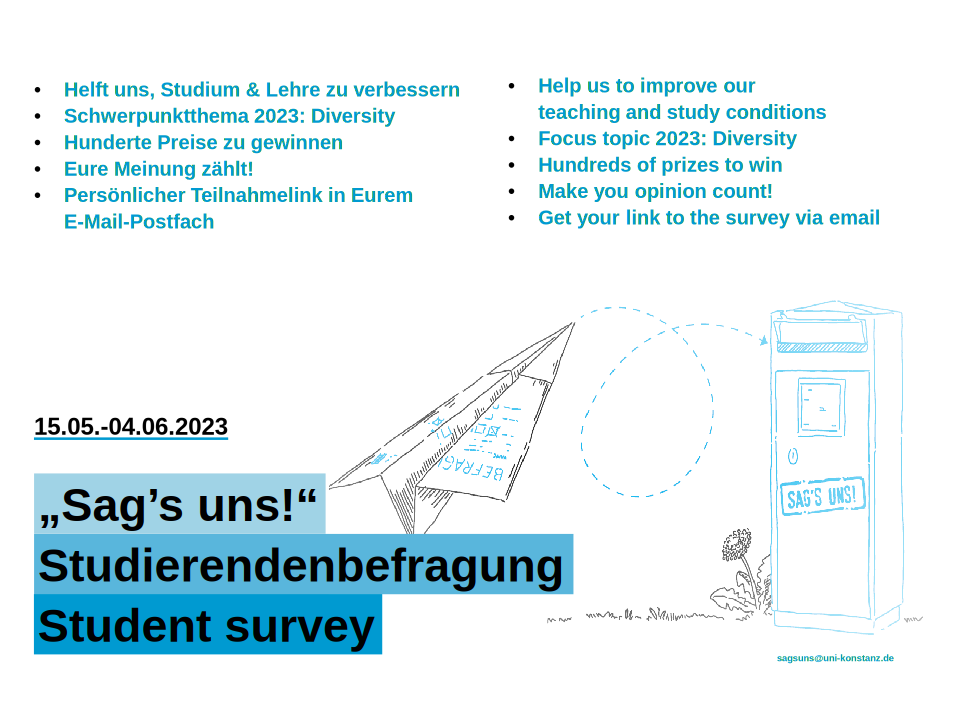
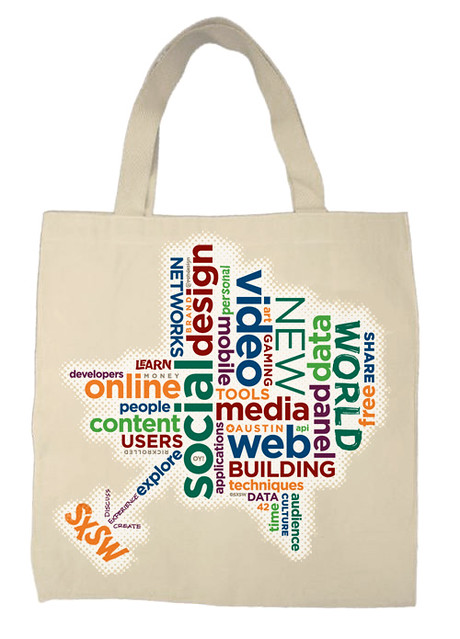
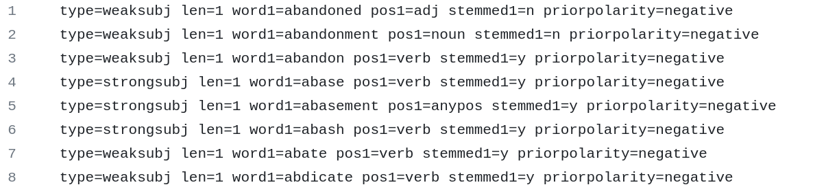
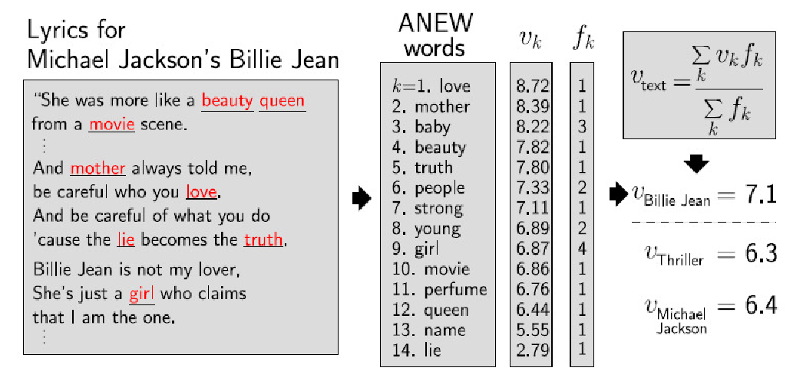
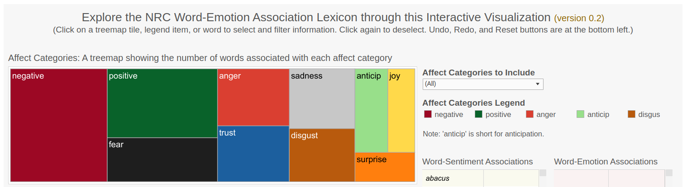

```{r xaringan-themer, include=FALSE, warning=FALSE}
#This block contains the theme configuration for the CSS lab slides style
library(xaringanthemer)
library(showtext)
style_mono_accent(
  base_color = "#5c5c5c",
  text_font_size = "1.5rem",
  header_font_google = google_font("Arial"),
  text_font_google   = google_font("Arial", "300", "300i"),
  code_font_google   = google_font("Fira Mono")
)
```

```{r setup, include=FALSE}
options(htmltools.dir.version = FALSE)
```

layout: true

<div class="my-footer"><span>David Garcia - Social Media Data Analysis</span></div> 

---
.center[]
---

# Outline

## 1. Basics of dictionary methods

## 2. Measuring emotions

## 3. Dictionary methods in sentiment analysis

## 4. Applications of dictionary-based sentiment analysis

---

# Dictionary methods: the General Inquirer

<div style="float:right">
  
</div>

The pioneer work of [Philip Stone in 1966](https://mitpress.mit.edu/books/general-inquirer
) proposed to process text with a computer to detect the use of words of various categories. This set the basis for **dictionary methods** in text analysis, which are based on counting the number of appearances of the words of a list in a text. 

The lists of [positive words](http://www.wjh.harvard.edu/~inquirer/Positiv.html) and of [negative words](http://www.wjh.harvard.edu/~inquirer/Negativ.html) of this version, which served as input for later methods like [SentiStrength](http://sentistrength.wlv.ac.uk/) (more on this later).

The [SentimentAnalysis R package](https://cran.r-project.org/web/packages/SentimentAnalysis/index.html) contains the General Inquirer (GI) dictionary and methods to match words in text.

---

# The assumption: bag of words

.pull-left[1. Tokenize text to identify words and expressions, for example identifing whitespace and punctuation
2. Count the number of tokens of each kind in each text (term frequency)

- Result: each document is represented by a vector of word counts
- Ignores word order or relationship between words]

.pull-right[.center[]]

---

# Bag of words example

| Text      | he | sat | on | the | bank | bear | is | brown | did  | not|  survive |  crisis | didn't |
| ----------- | ----------- | ----------- | ----------- | ----------- | ----------- | ----------- | ----------- | ----------- | ----------- | ----------- | ----------- |
| He sat on the bank      | 1 | 1 | 1 | 1 | 1 | 0 | 0 | 0 | 0  |  0 |  0 | 0 |0 | 
| The bear is brown   | 0 | 0 | 0 | 1 | 0 | 1 | 1 | 1 | 0  | 0|  0 | 0 | 0 | 
| The bank did not survive the crisis | 0 | 0 | 0 | 2 | 1 | 0 | 0 | 0 | 1  | 1|  1 | 1 | 0 | 
| He didn't sat on the bear | 1 | 1 | 1 | 1| 0 | 1 | 0 | 0 | 0 | 0 | 0 | 0 | 1 |
---

## Linguistic Inquiry and Word Count (LIWC)

.center[]  
LIWC (pronounced "Luke") was developed as a click-and-run software by [James Pennebaker in 2001](https://liwc.wpengine.com/), including word lists for emotions and ther classes.

---

# Examples of word classes in LIWC

- $funct_1$: **Function words**, words that do not carry strong meaning (structure)
  - $i_4$: **First-person references**, especially pronouns
  

- $affect_{125}$: **Affective words**, words signalling emotional experiences
  - $negemo_{127}$: **Negative emotion words**
    - $anx_{128}$: **Anxiety words**, words signalling fear, stress and anxiety


- $social_{121}$: **Social process words**, words about others, communities, and social activities


- $cogmech_{131}$: **Cognitive mechanisms**
  - $insight_{132}$: thinking and information processing
  - $incl_{138}$: inclusion terms, synthesis
  - $discrep_{134}$: discrepancy, identification of opposites

---

##Measuring emotions

## 1. Basics of dictionary methods

## *2. Measuring emotions*

## 3. Dictionary methods in sentiment analysis

## 4. Applications of dictionary-based sentiment analysis

---

# What are emotions?

> Emotions as **core affect**: Short-lived psychological states that consume the individual's energy and strongly influence cognition and behavior, for example expression.

Emotional or affective behavior of an individual takes place at various timescales:


- Reflex reactions: fast physiological responses  
- Core affect: relax quickly and are triggered by a stimulus
- Mood: slow-changing and constant emotional state 
- Personality traits are lifelong behavior patterns, some about emotions

---

# Computational Affective Science

> **Affective Science** is the (interdisciplinary) scientific study of emotions. 

> **Computational Affective Science** applies methods from Computer Science and Data Science to Affective Science. Some examples are:

- **Affective Computing:** Development of systems that detect, process, and elicit emotion  
- **Cyberpsychology of Affect:** Understanding the interplay between emotions and ICT  
- **Emotion Recognition:** Identification of human emotion using any kind of modality: text, voice, facial expression, physiological signals (skin conductance, muscle activity, EEG, fMRI), etc  
- **Sentiment Analysis:** Detection of subjective states from (textual) data, including emotion

---

# Measuring emotions

Emotions can be measured through various signals and observable behaviors:


In the following, we are going to cover four models of how to capture emotions in quantitative research. Some approaches are better for some modes or signals (e.g. text, facial expression) than others.

---

# Ekman's basic emotions model

.center[]
Developed by **Paul Ekman** to classify facial expression of emotions. 
---

# Plutchik's wheel of emotions
.center[]

---

# The circumplex model of affect

.center[]

---

# Dimensions in the circumplex model


> **Valence:** the degree of pleasure experienced in an emotion  
  
- Explains the most variance from positive/pleasant to negative/unpleasant
- It can be measured physiologically with smiling and frowning muscle activity
- It is the most common dimension of emotions included in text analysis  

> **Arousal:** the level of activity associated with an emotion  

- Explains less variance than valence but it is informative to differentiate emotions  
- It can be measured with skin conductance and heart rate sensors  
- Not so common in text analysis but can be estimated from voice tone  

---

# Positive And Negative Affect Schedule

.center[]

---


##Dictionary methods in sentiment analysis

## 1. Basics of dictionary methods

## 2. Measuring emotions

## *3. Dictionary methods in sentiment analysis*

## 4. Applications of dictionary-based sentiment analysis

---

#  What is Sentiment Analysis?

> **Sentiment Analysis:** Computerized quantification of subjective states from text

.center[]

- Examples of subjective states: Emotions, feelings, attitudes, opinions...  
- Often vaguely defined and roughly equivalent to the dimension of valence in the circumplex model
- Sentiment quantification can have various formats: polarity, scores, labels...  

---

# The Sentiment Analysis Boom

```{r echo=F, fig.width=14, fig.height=7, cache=T, fig.align='center'}
library(gtrendsR)
library(ggplot2)
trend <- gtrends("sentiment analysis", time="all")
ggplot(trend$interest_over_time, aes(x=date, y=hits)) + geom_line() + ylab("Google search volume") + xlab("Date") + theme_bw() + theme(text = element_text(size=30)) 
```

---

# Supervised vs Unsupervised Methods

- **Unsupervised sentiment analysis:**  
  - Uses expert knowledge (e.g. from psychologists) to quantify emotions  
  - Expert knowledge is encoded as a set of rules or a lexicon (dictionary) of words. Also known as "dictionary methods"  
  - Pros: Simple implementation, large coverage and recall  
  - Cons: Hard to customize for a particular context, low precision, expert bias

- **Supervised sentiment analysis (next week):**  
  - Uses a set of annotated texts to fit a model  
  - Annotations can come from readers or the authors of texts  
  - Pros: Automatic calibration, high precision  
  - Cons: Lower recall and coverage, need very large training datasets  

---

## Counting positive and negative words

.center[]

- Methods similar to LIWC that count the number of positive and negative words
- Example: [Multi-Perspective Question Answering (MPQA) subjectivity lexicon](https://mpqa.cs.pitt.edu/lexicons/)
- [Bing Liu opinion lexicon for product reviews](https://www.cs.uic.edu/~liub/FBS/sentiment-analysis.html)

---

## Averaging valence ratings: The hedonometer

.center[]

[Measuring the happiness of large-scale written expression: Songs, blogs, and presidents. P. Dodds & C. Danforth (2010)](https://psycnet.apa.org/record/2010-14167-004)

---
 # Counting emotion words: NRC lexicon

.center[]

Lexicon with words associated to Plutchik's wheel emotions plus positive/negative. Various additional versions including valence and translations.

[Crowdsourcing a Word-Emotion Association Lexicon, Saif Mohammad and Peter Turney, Computational Intelligence, 29 (3), 436-465, 2013.](https://arxiv.org/pdf/1308.6297.pdf)

---

# Applying modifiers: SentiStrength

.center[]
[Sentiment strength detection in short informal text. Thelwall, M., Buckley, K., Paltoglou, G. Cai, D., & Kappas, A.  Journal of the American Society for Information Science and Technology (2010)](https://onlinelibrary.wiley.com/doi/10.1002/asi.21416)

---

# VADER 
<div style="float:right">
  
</div>

VADER (Valence Aware Dictionary and sEntiment Reasoner) is a tool very similar to SentiStrength in the steps it follows:

1. Text preprocessing  
2. Word matching from a lexicon of positive/negative scored words  
3. Application of modifiers to the scores based on language rules
 
VADER's name suggests it is the "dark version" of LIWC ("Luke"). As the authors of VADER say

[VADER: A parsimonious rule-based model for sentiment analysis of social media text. C Hutto, E Gilbert, ICWSM (2013)](https://ojs.aaai.org/index.php/icwsm/article/view/14550)

---


##Applications of dictionary-based sentiment analysis


## 1. Basics of dictionary methods

## 2. Measuring emotions

## 3. Dictionary methods in sentiment analysis

## *4. Applications of dictionary-based sentiment analysis*

---

# London eye
.center[] 
- London Eye showing sentiment in Tweets during the 2012 Olympics
- The output of SentiStrength was converted to the color over the ferris wheel

---
# Digital humanities: Music lyrics
.center[] 
Application of ANEW lexicon to lyrics of songs since the 1960's  
[Measuring the happiness of large-scale written expression: Songs, blogs, and presidents. P. Dodds & C. Danforth (2010)](https://psycnet.apa.org/record/2010-14167-004)

---
# Syuzhet: plot sentiment
.center[] 
- Application of MPQA lexicon to the text of novels: [Syuzhet by M. Jockers](https://github.com/mjockers/syuzhet)
- Used to identify the six patterns of plots theorized by Kurt Vonnegut
---

# Google books misery

.center[] 

- Literary misery in Google Books: LIWC NA score (Germany example)
- Literary misery is correlated with economic misery of the previous decade
[Books Average Previous Decade of Economic Misery. Bentley et al (2014)](https://journals.plos.org/plosone/article?id=10.1371/journal.pone.0083147)

---

# Twitter mood and the stock market

.center[] 

- MPQA lexicon, also called OpinionFinder, applied to "I feel" tweets + adaptation of POMS (Profile of Mood States)
- Predicting movements of the Dow Jones Industrial Average (DJIA)  
[Twitter mood predicts the stock market. Bollen, Mao & Zeng (2011)](https://www.sciencedirect.com/science/article/pii/S187775031100007X)

---

# Trump2Cash

.pull-left[
- Google NLP API to classify sentiment about companies in Trump's tweets-
- Trading based on tweets: 59% annualized return (Feb 2017)

]  
.pull-right[] 

---


---

# Summary

- Basics of dictionary methods
  - The idea: measuring word frequencies from dictionaries (word lists)
  - LIWC as one of the most popular methods
  - Several classes beyond sentiment: social processes, cognition, etc


- Measuring emotions
  - Several models depending on modality and timescale
  - Models in text analysis: basic emotions, circumplex, PANAS


- Dictionary methods in sentiment analysis
  - Basic methods building on word counts
  - Methods using modifiers (amplifiers, negations): SentiStrength and VADER


- Applications of dictionary-based sentiment analysis
  - From humanities to finance, methods validation and representation matter
