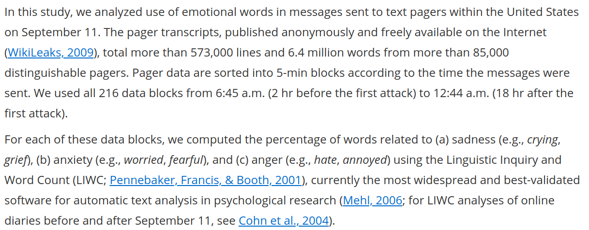
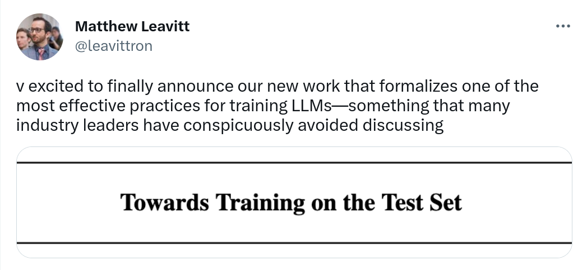
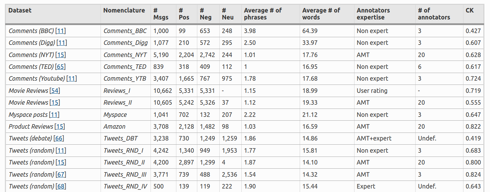
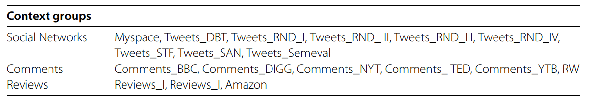
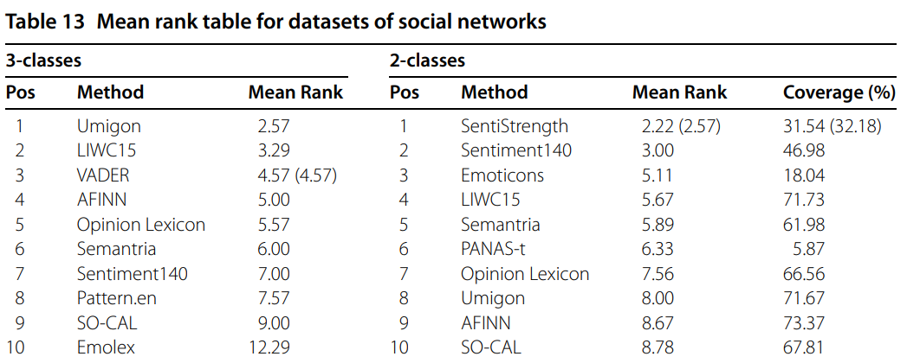

```{r xaringan-themer, include=FALSE, warning=FALSE}
#This block contains the theme configuration for the CSS lab slides style
library(xaringanthemer)
library(showtext)
style_mono_accent(
  base_color = "#5c5c5c",
  text_font_size = "1.5rem",
  header_font_google = google_font("Arial"),
  text_font_google   = google_font("Arial", "300", "300i"),
  code_font_google   = google_font("Fira Mono")
)
```

```{r setup, include=FALSE}
options(htmltools.dir.version = FALSE)
```

layout: true

<div class="my-footer"><span>David Garcia - Soxial Media Data Analysis</span></div> 

---

# So Far

- **Block 1: Introduction**
  - Introduction to social media data analysis within social data science
  - Algorithms and digital traces: The case of Google trends
  - Ethics and privacy in social media data analysis


- **Block 2: Social dynamics**
  - Social impact theory and its application to social media
  - Social trends and the Simmel effect


- **Block 3: Text in social media**
  - Dictionary methods in social media data analysis
      - Emotion measurement
      - Basics of dictionary methods and their application to sentiment analysis
      - Application examples of dictionary methods
---

# Outline

## 1. When dictionary methods go wrong

## 2. Supervised methods in NLP

## 3. Comparing methods in SMDA


---

#  The digital traces of pagers

.center[]
Back in the 90s, [pagers](https://en.wikipedia.org/wiki/Pager) were a common form of mobile communication. To send a message to a pager, you could call a special phone number, say your message, and the text of the message would appear in the screen of the pager.


---
#  Emotions in pagers after 9/11 
.center[]

[The Emotional Timeline of September 11, 2001. Mitja D. Back, Albrecht C.P. Küfner, and Boris Egloff. Psychological Science (2010)](https://journals.sagepub.com/doi/full/10.1177/0956797610382124)

---
.center[]
---

## Not so angry americans
More than a third of anger words appeared in messages like these:

"Reboot NT machine [name] in cabinet [name] at [location]:CRITICAL:[date and time]."  

The word "critical" is contained in the anger word list of LIWC!

---

### Anger timeline without REBOOT messages
.center[]

---

## The issue of machine-generated traces

<div style="float:right">
  
</div>

Not all digital traces are generated by humans, a large volume of data is generated by machines. 

During the summer of 2018, Twitter made a big bot cleanse, but independent estimates before reported that between [9% and 15% of Twitter accounts were likely to be bots](https://ojs.aaai.org/index.php/ICWSM/article/view/14871/14721). 

One of the most widely used methods to detect bots on Twitter is [Botometer](https://botometer.osome.iu.edu/), which is in constant development by the [OSoMe lab at Indiana University](https://osome.iu.edu/).
Even if you clean bots from your data, you should always take a good look at your text. You can make word clouds, word shift graphs, or just browse through it to see if you notice anomalous patterns. To sum up:

> Take home message: Do not just analyze text, also look at it!


---

# Supervised methods in NLP

## 1. When dictionary methods go wrong

## *2. Supervised methods in NLP*

## 3. Comparing methods in SMDA
---

# Representations of text

**Text representation:** computing a fixed-length vector from a text to train a model on the features (values) of the vector

- **TF (Term Frequency) vector:** Using a bag of words assumption, represent each text as a vector of frequencies of the words in the language

- **TF-IDF (Term Frequency - Inverse Document Frequency):** Same but dividing by the total frequency of the term in all documents
  - Both TF and TF-IDF generate very long vectors (number of possible words) with many zeroes
  - Some approaches to remove rare words or uninformative stopwors
  - Requires design decisions: include punctuation? stem words?

- **Denser representations:** More on those next week

---

# How to train your model
.center[] 

1. **Training:** Texts with annotations of sentiment are used to fit the model  
2. **Validation:** A second set of annotated texts not used for training are used to evaluate the quality of the model: $Q_{1}$  
3. **Testing:** One last evaluation run of the fitted model with a leave-out sample of annotated texts. None of these texts should have been part of the validation or training steps. Testing quality $Q_2$ measures predictive quality of the model.
---

# Be extra careful with test sets
.center[] 

---

# Gold Standards and Ground Truths


pos | neg | text  
------------- | ------------- | -------------
0 | 0 |  I wana see the vid Kyan  
0 | 1 | I cant feel my feet.. that cant be good..  
1 | 0 | 10 absolutely jaw dropping concept car designs http://ow.ly/15OnX  
0 | 0 | Phil Collins- You Can’t Hurry Love

- Supervised sentiment analysis needs a set of labeled texts to learn from.
- Labels can come from the author of the text or from reading raters
- The above table is an example from a real dataset with two annotations: a positivity score and a negativity score
- Other ground truths  might have numeric scores in a scale or text labels for basic emotional states.

---

# Text preprocessing

.center[]

Pre-processing from [Text Analytics for Beginners using NLTK, Navlani, 2019](https://www.datacamp.com/community/tutorials/text-analytics-beginners-nltk)

---

# What model to use?

Common approaches are:  
1. **Naive Bayes:** Takes features as independent signals and fits the label according to Bayes Rule  
2. **Support Vector Machine:** Finds a separator given a (non-)linear combination of features  
3. **Random Forest:** Finds hierarchical decision rules that divide the texts in classes

In supervised sentiment analysis, generating the ground truth data is the most critical part and is required to train the model. Producing sufficient annotations from readers or authors can be expensive. Supervised methods are usually not out-of-the-box like unsupervised tools, you would have to fit your own model to a ground truth dataset.

---
<div style="float:right">

</div>
# Evaluating classifiers 

- True positives $TP$: All positive cases that are correctly predicted

- False positives $FP$: All negatives that were wrongly predicted as positive

- True negatives $TN$: All negative cases that are correctly predicted 

- False negatives $FN$: All positive cases that were incorrectly predicted as negative

---

# Accuracy, Precision, and Recall
$$Accuracy = \frac{TP+TN}{TP+FP+TN+FN}$$
$$Precision = \frac{TP}{TP+FP}$$
$$Recall = \frac{TP}{TP+FN}$$  
- The measure of precision answers the question "How sure am I of this prediction?"
- The measure of recall answers the question  "How many of the things that I’m looking for are found?"

---

# Balancing precision and recall

A way to compute a trade-off between Precision and Recall is the $F_1$ score, which is a harmonic mean of Precision and Recall:

$$F_1= 2 ∗ \frac{ Precision ∗ Recall} {Precision + Recall}$$

The $F_1$ score is often used as a way to summarize the quality of classifiers. When more than one class is possible, you should look at the mean of $F_1$ over the classess or to the $F_1$ of each class separately. The $F_1$ score is often used in sentiment analysis competitions to chose the best tools, for example in the [SemEval 2017 competition](https://alt.qcri.org/semeval2017/index.php?id=tasks).

---

# Let someone else do it: Black-box APIs

.center[]

Easy to use but data and methods unknown. Do your own evaluation!

---

.center[]

---

# Comparing methods in SMDA

## 1. When dictionary methods go wrong

## 2. Supervised methods in NLP

## *3. Comparing methods in SMDA*

---

# Benchmarking sentiment analysis

.center[]
[SentiBench - a benchmark comparison of state-of-the-practice sentiment analysis methods
F. Ribeiro, et al. EPJ Data Science (2016)](https://epjdatascience.springeropen.com/articles/10.1140/epjds/s13688-016-0085-1)

---

# Benchmark setup

.center[]
- 18 labeled datasets in three groups: Social networks, coomments, reviews
- 24 out-of-the box sentiment analysis methods
  - includes dictionary-based (LIWC, NRC)
  - rule-based (VADER, SentiStrength)
  - some supervised methods (SASA)
- Two tasks:
  - 2-class (positive/negative), given that it is not neutral
  - 3-class (positive/negative/neutral)
- Evaluation based on $F_1$ score per class - summary as mean rank of methods


---
## Mean $F_1$ across datasets
.center[]

---

# Ranking for social network data
.center[]

---


# Validity of using text analysis at scale?

.pull-left[
```{r, echo=FALSE, out.width=1100}
knitr::include_graphics("figures/Macy.jpg")
```
<font size="5">
<a href="https://science.sciencemag.org/content/333/6051/1878/"> Diurnal and seasonal mood vary with work, sleep, and daylength across diverse cultures. Golder & Macy, Science (2011) </a>
</font>
]

.pull-right[
```{r, echo=FALSE, out.width=1100}
knitr::include_graphics("figures/hedonometer.png")
```

<font size="5">
<a href="https://journals.plos.org/plosone/article?id=10.1371/journal.pone.0026752"> Temporal patterns of happiness and information in a global social network: Hedonometrics and Twitter. Dodds et al. PLoS One (2011) </a>
</font>
]

---

# Validating a UK emotion macroscope

```{r, echo=FALSE, out.width=975, fig.align='center'}
knitr::include_graphics("figures/MacroTest2.svg")
```

---


# Validating a UK emotion macroscope
1. Two years of weekly representative UK emotion survey by YouGov
2. UK Twitter data for the same period: 1.5 Billion tweets (without RT)
3. Text analysis: dictionary-based (LIWC) and supervised (RoBERTa)
4. Gender detection of twitter users based on profile
5. Gender-rescaled time series of emotional expression

```{r, echo=FALSE, out.width=900, fig.align='center'}
knitr::include_graphics("figures/Data.svg")
```

---
# Sadness in Twitter and YouGov

```{r, echo=FALSE, out.width=1200, fig.align='center'}
knitr::include_graphics("figures/Sadness.svg")
```

- Similar results with dictionary-based and supervised (r~0.65)
---

# Anxiety in Twitter and YouGov

```{r, echo=FALSE, out.width=1200, fig.align='center'}
knitr::include_graphics("figures/Anxiety.svg")
```

- Better results with dictionary-based method and with gender rescaling
- Results robust to autocorrelation and heteroskedasticity

---

# Joy in Twitter and YouGov

```{r, echo=FALSE, out.width=1200, fig.align='center'}
knitr::include_graphics("figures/Joy.svg")
```

- Substantially better results with supervised method than dictionary-based
---

# Exploring 12 emotional states
.pull-left[

- Time series of number sentences like "I am [emotion]" on Twitter

- Weak correlations happen for infrequent emotions in text

- Comparison: US weekly pre-election polls correlate with 0.66

- Arxiv preprint at https://arxiv.org/abs/2107.13236

]

.pull-right[
```{r, echo=FALSE, out.width=700}
knitr::include_graphics("figures/Figure2.svg")
```
]

---

layout: true
<div class="my-footer"><span>
Validating daily social media macroscopes of emotions. Max Pellert, Hannah Metzler, Michael Matzenberger, David Garcia. Scientific Reports (2022)</span></div>

---

## Study 2: Validating an Austrian macroscope

.pull-left[

- 20-day emotion survey in derstandard.at (N=268,128)
- Daily frequency, 3-day windows

- Text from Der Standard forum (N=452,013)

- Austrian tweets (N=515,187) filtered as UK macroscope

- Compared dictionary-based (LIWC) and supervised model (GS)

]
.pull-right[
```{r, echo=FALSE, out.width=800}
knitr::include_graphics("figures/DS1.svg")
```
]

---

## Twitter sentiment and Der Standard survey

```{r, echo=FALSE, out.width=1000, fig.align='center'}
knitr::include_graphics("figures/DS2.svg")
```

---

# Correlations with new COVID-19 cases

.pull-left[
```{r, echo=FALSE, out.width=600}
knitr::include_graphics("figures/DS31.svg")
```
]
.pull-right[
```{r, echo=FALSE, out.width=600}
knitr::include_graphics("figures/DS32.svg")
```
]

- Do correlations attenuate due to additional social media measurement error?
- Survey emotion correlation with new cases as strong as Twitter sentiment
- Errors sources might be different: Need for conceptual validations

---
# Summary

- When dictionary methods go wrong
  - The case of LIWC on pagers after 9/11
  - Reading the data matters! Visualizations, random samples, etc


- Supervised methods
  - Gold standards as annotated texts
  - The importance of the separation of training and test
  - Evaluation: Precision, Recall, and $F_1$


- Comparing and evaluation methods
  - SentiBench: a 2016 benchmark to compare methods
  - Validations beyond documents: time series in the UK and Austria
  
  
---

# Form for input on exam date

.pull-left[
- Exam room space very limited

- No central coordination for exam conflicts among elective courses

- Two options for exam date:
  - 25.07 10:00-11:30
  - 26.07 10:00-11:30

- Fill the form today if you prefer one!

https://forms.gle/F5JzCv4L6ZGtX7Fu9
]

.pull-right[
.center[]
]


